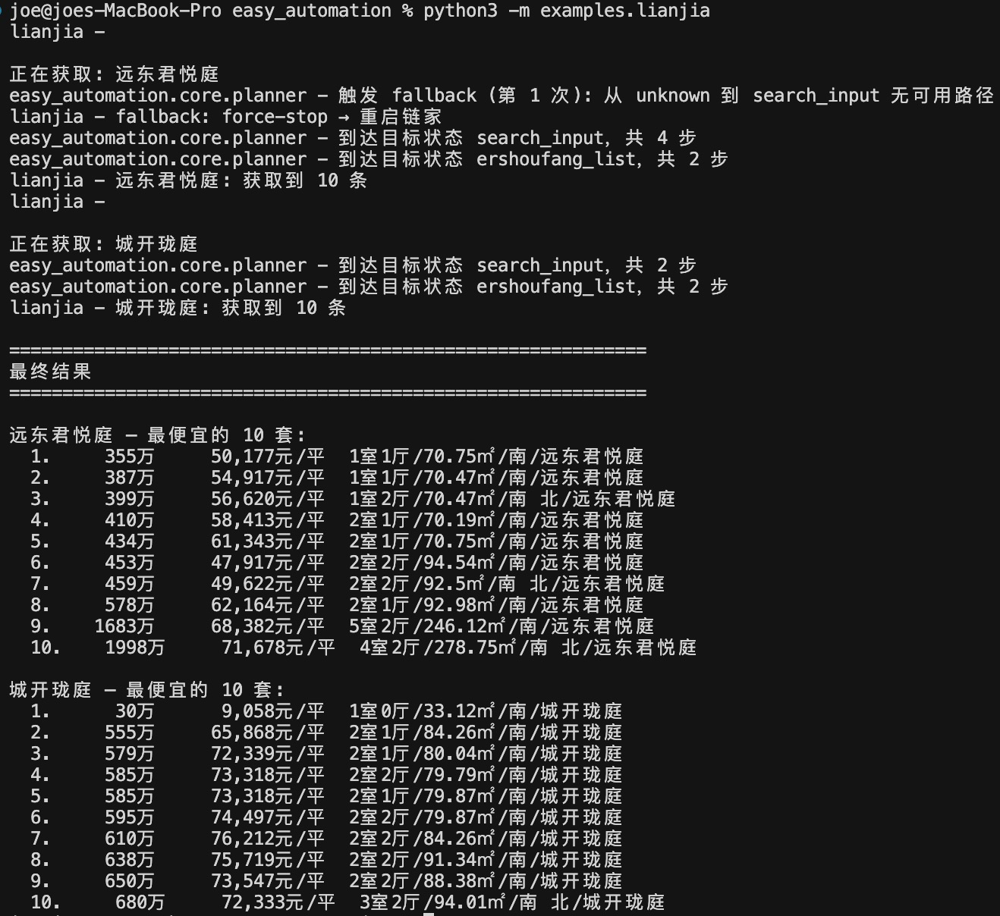

有状态的古法UI自动化  

**一般UI自动化代码是线性的代码, 举例: a -> b -> c -> d 四个步骤**     
缺陷:    
- 每个任务需要从头开始   
> 第一个case跑完了, 跑第二个case需要从第一步a开始  

- 每个步骤需要加校验逻辑  
> ui自动化是脆弱的不稳定的, 可能冷不丁出现弹窗、登录 等, 导致线性的代码需要每个步骤之后要加较多的case判断和处理, 导致代码膨胀  

所以引入状态的概念, 类似状态机, 代码模式由 `线性执行` -> `动态路径规划`  


状态检测与路径规划
states定义状态和condition, 执行引擎循环执行
- 判断当前state 
- 路径规划 
> 贪心算法计算 当前state -> 目标state 的路径
- 执行当前state到路径中next state的切换动作

  
**解决死循环**  
state entry_times 计数器, 一个state entry了n次, 则路径规划时排除掉next state是它的路径, 如果无路径则raise异常
  
**解决卡死**  
连续n次相同状态, 走fallback


**demo用例**  
去链家爬取小区最便宜的10套房子价格(多个小区), 用例由claude code生成    
`python3 -m examples.lianjia`  
核心代码片段:  
```
sm = StateMachine(GRAPH, functions=FUNCTIONS, context={}) # 构建状态机  

for xiaoqu in xiaoqu_list:
    logger.info(f"\n\n正在获取: {xiaoqu}")

    sm.context["xiaoqu"] = xiaoqu # 设置状态机的context, 目标小区, action会读它
    sm.goto("search_input") # 去目标页面, 状态机会根据 状态机graph 自主寻找路径 直至到达目标页面  
    sm.goto("ershoufang_list") # 同上

    # 到达目标页后的我们自己写代码爬取页面信息  
    sort_by_price_low_to_high() # 排序: 总价从低到高
    prices = scrape_top_prices(10) # 抓取前10个价格
    all_results[xiaoqu] = prices
    logger.info(f"{xiaoqu}: 获取到 {len(prices)} 条")
```
